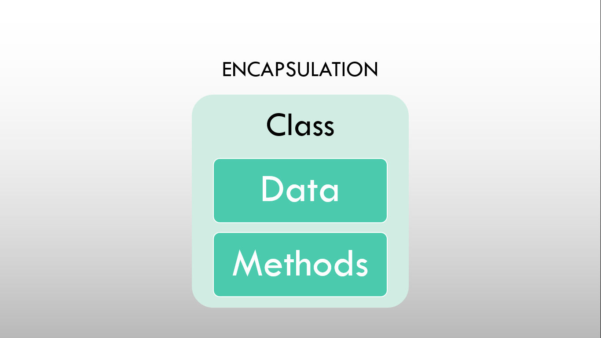

# ⚡Basic Overview on OOPs Concepts

## OOPS Concepts

There are six fundamental concepts of OOPs.

- Class
- Objects
- Abstraction
- Inheritance
- Encapsulation
- Polymorphism

## Class and Objects

### Class

#### 

- Class is just a blueprint, logical, definition, prototype thing through which we can create an object.
- Class is a user-defined datatype like a structure in Procedural Oriented Programming Paradigm.
- Class consists of data and code.
- Data consists of properties or attributes and Code consists of methods or functions.
- The properties and functions of a class can be accessed using object of these class.
- They are the group of objects which share common properties or attributes.

### Object

#### 

- Objects are the instance or real life entity created using class.
- Each objects have their own data and function.
  Each objects can interact with each other with the help of message pass.
- For interacting, they don't need to have the internal knowledge of each other data and code.

## Inheritance

#### 

- Using inheritance, a child class can inherit the data and code or common properties from the base class.
- Inheritance provides code reusability.
- Using inheritance, we can only manipulate the data of object whose data and code are binded together in that object.

## Abstraction

#### 

- Abstraction includes hiding the implementation detail from the world and showing only the relevant detail to the world.
- It includes hiding something into a function or interface.

## Encapsulation

#### 

- Encapsulation includes wrapping up of data and functions into a single unit.
- We can hide this data from the outside world using access specifier.
- Encapsulation provides data security and privacy.

## Polymorphism

#### 

- Polymorphism simply means having multiple forms of a same instance.
- They are of two types:
  - Overloading
  - Overriding
- Overloading example: a same function can have multiple forms which act and react differently according to situation.
- Overriding example: a child class can implement function from parent class according to its need.
