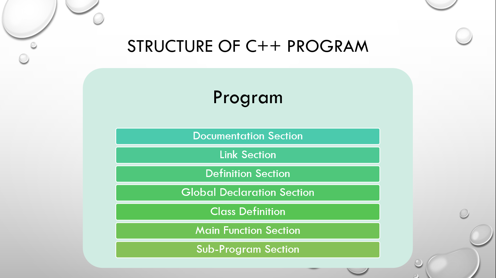

# ⚡Structure of C++ Program

#### 

## Documentation Section

This section features general information about the program written such as who is the author of program?, what is the program about?. So, it gives a basic overview of a program without actually looking through line by line of code. But this is not mandatory. It is written using comments that might be single line or multiline comment.

## Link Section

There are two sections in link section in C++ program. It includes header and namespace. In order to use such pre-defined elements in a program, an appropriate header must be included in the program. For example: <iostream> header is used to for accessing standard streams. A namespace permits grouping of various entities like classes, objects, functions, and various C++ tokens, etc. under a single name. Namespaces can be accessed in multiple ways i.e. using namespace std; or using std :: cout;. This is compulsory.

## Definition Section

This section features declaration of constants, user-defined data type, macro definition like #define. This is optional.

## Global Declaration Section

This section features declaration of global variables and class defintions.The scope of the variable declared in this section lasts all over the program.Similarly, these variables are accessible within the user-defined functions also. This is also optional.

## Class Definition

This features of definition of data members and member function of a class. This is also optional.

## Main Function Section

This section is the starting point of C++ programs, containing all the executable statements within its curly braces {}. When the program runs, the compiler sequentially executes the instructions in the main function. After completing these instructions, the program terminates, and no further execution occurs. This is compulsory.

## Sub-Program Section

This section features additional functions i.e. user-defined functions. This is also optional.
