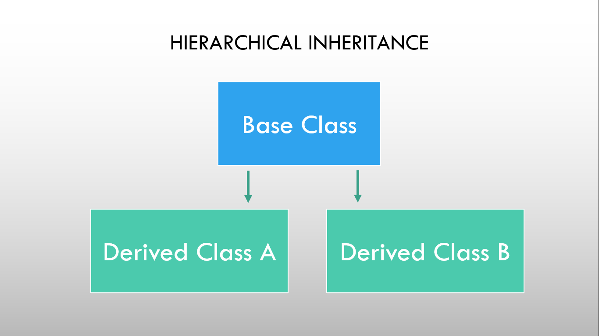

# ⚡Hierarchial Inheritance

### 

As shown in the figure, in hierarchical inheritance several derived classes are inherited from a single base class. Based on the visibility mode used or access specifier used while deriving, the properties of the base class are derived. Access specifier can be private, protected or public.

### Example

```cpp
// Program to demonstrate Hierarchial inheritance

#include <iostream>
using namespace std;

// base class
class StudentDetails
{
  int id;
  string name;

public:
  void getDetails()
  {
    cout << "Student ID: ";
    cin >> id;
    cout << "Student Name: ";
    cin >> name;
  }
};

// first derived class
class SubjectMarks : public StudentDetails
{
protected:
  float physics, maths;

public:
  void getMarks()
  {
    cout << "Physics Marks: ";
    cin >> physics;
    cout << "Maths Marks: ";
    cin >> maths;
  }
};

// second derived class
class Result : public SubjectMarks
{
  float totalMarks;

public:
  void getResult()
  {
    totalMarks = physics + maths;
    cout << "Total Marks: " << totalMarks;
  }
};

int main()
{
  Result Bishal;
  Bishal.getDetails();
  Bishal.getMarks();
  Bishal.getResult();
  return 0;
}
```

```
Output:
Student ID: 1
Student Name: Bishal_Baniya
Physics Marks: 66
Maths Marks: 55
Total Marks: 121
```
