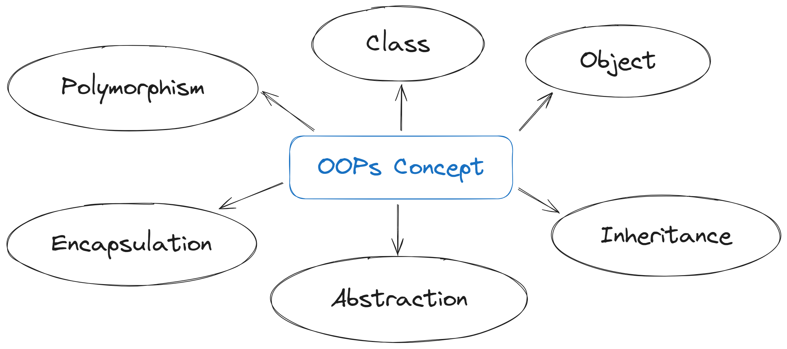

# 🎯 C++ with OOPs

### 

### 1. Basics

- <a href="https://github.com/ashish-shr/100-Days-of-CPP-Programming/tree/main/Day_01_Introduction_to_Programming_Paradigm">Introduction to Programming Paradigms</a>
- <a href="https://github.com/ashish-shr/100-Days-of-CPP-Programming/tree/main/Day_02_Basic_overview_of_OOPs_concepts">Basic Overview of OOPs Concepts</a>
- <a href="https://github.com/ashish-shr/100-Days-of-CPP-Programming/tree/main/Day_03_Introduction_Features_History_of_C%2B%2B">Introduction, Features and History of C++ Programming</a>
- <a href="https://github.com/ashish-shr/100-Days-of-CPP-Programming/tree/main/Day_04_Structure_of_C%2B%2B_Program">Structure of C++ Program</a>
- <a href="https://github.com/ashish-shr/100-Days-of-CPP-Programming/tree/main/Day_05_Constants_Variables_Keywords_Indentifiers">Constants, Variables, Keywords and Identifiers in C++</a>
- <a href="https://github.com/ashish-shr/100-Days-of-CPP-Programming/tree/main/Day_06_Datatypes_in_C%2B%2B">Datatypes in C++</a>
- <a href="https://github.com/ashish-shr/100-Days-of-CPP-Programming/tree/main/Day_07_Input_Output_in_C%2B%2B">Input and Output in C++</a>
- <a href="https://github.com/ashish-shr/100-Days-of-CPP-Programming/tree/main/Day_08_Operators_in_C%2B%2B">Operators in C++</a>
- <a href="https://github.com/ashish-shr/100-Days-of-CPP-Programming/tree/main/Day_09_Operators_Precendence_and_Associativity">Operator Precedence and Associativity in C++</a>
- <a href="https://github.com/ashish-shr/100-Days-of-CPP-Programming/tree/main/Day_42_Reference_variables">Reference Variables in C++</a>

### 2. Selection Control Statements

- <a href="https://github.com/ashish-shr/100-Days-of-CPP-Programming/tree/main/Day_10_Selection_Control_Structures">Selection Control Structures</a>
- <a href="https://github.com/ashish-shr/100-Days-of-CPP-Programming/tree/main/Day_11_Tricky_if_else">Tricky if..else</a>
- <a href="https://github.com/ashish-shr/100-Days-of-CPP-Programming/tree/main/Day_12_Switch_Case_Statement">Switch Case Statements</a>
- <a href="https://github.com/ashish-shr/100-Days-of-CPP-Programming/tree/main/Day_13_Problems_on_Conditional_Statements">Problems on Conditional Statements</a>

### 3. Iteration Control Statements

- <a href="https://github.com/ashish-shr/100-Days-of-CPP-Programming/tree/main/Day_14_Introduction_to_Loops">Introduction to Loops</a>
- <a href="https://github.com/ashish-shr/100-Days-of-CPP-Programming/tree/main/Day_15_Loops_Exercise">Loops Exercise</a>
- <a href="https://github.com/ashish-shr/100-Days-of-CPP-Programming/tree/main/Day_16_Range_based_for_loop">Range Based Loop</a>
- <a href="https://github.com/ashish-shr/100-Days-of-CPP-Programming/tree/main/Day_17_Range_Exercise">Range Exercise</a>
- <a href="https://github.com/ashish-shr/100-Days-of-CPP-Programming/tree/main/Day_18_Break_and_Continue">Break and Continue Statement</a>

### 4. Arrays, Strings and Pointers

- <a href="https://github.com/ashish-shr/100-Days-of-CPP-Programming/tree/main/Day_19_Arrays">Arrays in C++</a>
- <a href="https://github.com/ashish-shr/100-Days-of-CPP-Programming/tree/main/Day_20_Array_Exercise">Arrays Exercise</a>
- <a href="https://github.com/ashish-shr/100-Days-of-CPP-Programming/tree/main/Day_78_C%2B%2B_Strings">Strings in C++</a>
- <a href="https://github.com/ashish-shr/100-Days-of-CPP-Programming/tree/main/Day_21_Pointers">Pointers</a>
- <a href="https://github.com/ashish-shr/100-Days-of-CPP-Programming/tree/main/Day_22_Pointer_Arithmetic">Pointer Arithmetic</a>
- <a href="https://github.com/ashish-shr/100-Days-of-CPP-Programming/tree/main/Day_51_New_and_Delete_Operators">New and Delete Operators</a>
- <a href="https://github.com/ashish-shr/100-Days-of-CPP-Programming/tree/main/Day_52_Arrow_Operator">Arrow Operator</a>
- <a href="https://github.com/ashish-shr/100-Days-of-CPP-Programming/tree/main/Day_53_This_Pointer">This Pointer</a>

### 5. Functions in C++

- <a href="https://github.com/ashish-shr/100-Days-of-CPP-Programming/tree/main/Day_24_Functions_and_Function_Prototypes">Functions and Function Prototypes</a>
- <a href="https://github.com/ashish-shr/100-Days-of-CPP-Programming/tree/main/Day_25_Call_by_Value_and_Reference">Call by Value and Call by Reference</a>
- <a href="https://github.com/ashish-shr/100-Days-of-CPP-Programming/tree/main/Day_26_Inline_Functions_Default_and_Constant_Arguments">Inline Function, Default and Constants Arguments</a>
- <a href="https://github.com/ashish-shr/100-Days-of-CPP-Programming/tree/main/Day_27_Recursions_and_Recursive_Functions">Recursions and Recursive Functions</a>
- <a href="https://github.com/ashish-shr/100-Days-of-CPP-Programming/tree/main/Day_28_Function_Overloading">Function Overloading</a>

### 6. Objects and Classes

- <a href="https://github.com/ashish-shr/100-Days-of-CPP-Programming/tree/main/Day_23_Structures_Unions_Enums">Structures, Unions and Enums in C++</a>
- <a href="https://github.com/ashish-shr/100-Days-of-CPP-Programming/tree/main/Day_29_Class_and_Object_Definition">Class and Object Definition</a>
- <a href="https://github.com/ashish-shr/100-Days-of-CPP-Programming/tree/main/Day_30_Accessing_Data_Members_Access_Modifiers">Accessing Data Members and Access Modifiers</a>
- <a href="https://github.com/ashish-shr/100-Days-of-CPP-Programming/tree/main/Day_34_Static_Data_Members_and_Functions">Static Data Members and Functions</a>
- <a href="https://github.com/ashish-shr/100-Days-of-CPP-Programming/tree/main/Day_41_Array_of_objects">Array of Objects</a>
- <a href="https://github.com/ashish-shr/100-Days-of-CPP-Programming/tree/main/Day_35_Memory_allocation_for_an_object">Memory Allocation for an Object

### 7. Class Constructors and Destructors

- <a href="https://github.com/ashish-shr/100-Days-of-CPP-Programming/tree/main/Day_31_Class_Constructors">Class Constructors</a>
- <a href="https://github.com/ashish-shr/100-Days-of-CPP-Programming/tree/main/Day_32_Types_of_Class_Constructors">Types of Class Constructors</a>
- <a href="https://github.com/ashish-shr/100-Days-of-CPP-Programming/tree/main/Day_36_Passing_Objects">Passing Objects</a>
- <a href="https://github.com/ashish-shr/100-Days-of-CPP-Programming/tree/main/Day_77_Shallow_Copying_and_Deep_Copying_with_Copy_Constructor">Shallow Copying and Deep Copying with Copy Constructor</a>
- <a href="https://github.com/ashish-shr/100-Days-of-CPP-Programming/tree/main/Day_33_Destructors">Class Destructors</a>
- <a href="https://github.com/ashish-shr/100-Days-of-CPP-Programming/tree/main/Day_37_Constructor_Overloading_and_Constructor_with_Default_arguments">Constructor Overloading and Constructor with Default Arguments</a>
- <a href="https://github.com/ashish-shr/100-Days-of-CPP-Programming/tree/main/Day_38_Dynamic_Initialization_of_Objects_using_Constructors">Dynamic Initialization of Objects using Constructors</a>
- <a href="https://github.com/ashish-shr/100-Days-of-CPP-Programming/tree/main/Day_76_Constructor_Initialization_List">Constructor Initialization List</a>

### 8. Friend Functions and Friend Classes

- <a href="https://github.com/ashish-shr/100-Days-of-CPP-Programming/tree/main/Day_39_Friend_Functions">Friend Functions</a>
- <a href="https://github.com/ashish-shr/100-Days-of-CPP-Programming/tree/main/Day_40_Friend_Classes">Friend Classes</a>

### 9. Operator Overloading

- <a href="https://github.com/ashish-shr/100-Days-of-CPP-Programming/tree/main/Day_43_Operator_Overloading">Introduction to Operator Overloading</a>
- <a href="https://github.com/ashish-shr/100-Days-of-CPP-Programming/tree/main/Day_44_Overloading_Equality_Operator">Overloading Equality Operator</a>
- <a href="https://github.com/ashish-shr/100-Days-of-CPP-Programming/tree/main/Day_45_Overloading_Binary_Operator">Overloading Binary Operator</a>
- <a href="https://github.com/ashish-shr/100-Days-of-CPP-Programming/tree/main/Day_46_Overloading_Unary_Operators">Overloading Unary Operator</a>
- <a href="https://github.com/ashish-shr/100-Days-of-CPP-Programming/tree/main/Day_47_Overloading_Assignment_and_Shorthand_Assignment_Operators">Overloading Assignment and Shorthand Assignment Operator</a>
- <a href="https://github.com/ashish-shr/100-Days-of-CPP-Programming/tree/main/Day_48_Overloading_Comparison_Operators">Overloading Comparision Operator</a>
- <a href="https://github.com/ashish-shr/100-Days-of-CPP-Programming/tree/main/Day_49_Overloading_Logical_Operators">Overloading Logical Operator</a>
- <a href="https://github.com/ashish-shr/100-Days-of-CPP-Programming/tree/main/Day_50_Overloading_Insertion_and_Extraction_Operators">Overloading Insertion and Extraction Operator</a>
- <a href="https://github.com/ashish-shr/100-Days-of-CPP-Programming/tree/main/Day_54_Overloading_new_and_delete_Operators">Overloading New and Delete Operator</a>
- <a href="https://github.com/ashish-shr/100-Days-of-CPP-Programming/tree/main/Day_55_Overloading_Arrow_Operator">Overloading Arrow Operator</a>
- <a href="https://github.com/ashish-shr/100-Days-of-CPP-Programming/tree/main/Day_56_Overloading_Array_subscript_and_Function_call_operator">Overloading Array Subscript and Function Call Operator</a>
- <a href="https://github.com/ashish-shr/100-Days-of-CPP-Programming/tree/main/Day_57_String_Manipulation_using_Operator_Overloading">String Manipulation using Operator Overloading</a>
- <a href="https://github.com/ashish-shr/100-Days-of-CPP-Programming/tree/main/Day_58_Data_Conversion">Data Conversion</a>

### 10. Inheritance

- <a href="https://github.com/ashish-shr/100-Days-of-CPP-Programming/tree/main/Day_59_Introduction_to_Inheritance">Introduction to Inheritance</a>
- <a href="https://github.com/ashish-shr/100-Days-of-CPP-Programming/tree/main/Day_60_Inheritance_Syntax_and_Visibility_Modes">Inheritance Syntax and Visibility Modes</a>
- <a href="https://github.com/ashish-shr/100-Days-of-CPP-Programming/tree/main/Day_61_Single_Level_Inheritance">Single-Level Inheritance</a>
- <a href="https://github.com/ashish-shr/100-Days-of-CPP-Programming/tree/main/Day_62_Multiple_inheritance">Multiple Inheritance</a>
- <a href="https://github.com/ashish-shr/100-Days-of-CPP-Programming/tree/main/Day_63_Multilevel_Inheritance">Multi-Level Inheritance</a>
- <a href="https://github.com/ashish-shr/100-Days-of-CPP-Programming/tree/main/Day_64_Hierarchial_Inheritance">Hierarchial Inheritance</a>
- <a href="https://github.com/ashish-shr/100-Days-of-CPP-Programming/tree/main/Day_65_Hybrid_Inheritance">Hybrid Inheritance</a>
- <a href="https://github.com/ashish-shr/100-Days-of-CPP-Programming/tree/main/Day_66_Method_Overriding">Method Overriding</a>
- <a href="https://github.com/ashish-shr/100-Days-of-CPP-Programming/tree/main/Day_67_Ambiguity_Resolution_in_Inheritance">Ambiguity Resolution in Inheritance</a>
- <a href="https://github.com/ashish-shr/100-Days-of-CPP-Programming/tree/main/Day_68_Virtual_Base_Class">Virtual Base Class</a>
- <a href="https://github.com/ashish-shr/100-Days-of-CPP-Programming/tree/main/Day_69_Constructors_in_Inheritance">Constructors in Inheritance</a>
- <a href="https://github.com/ashish-shr/100-Days-of-CPP-Programming/tree/main/Day_70_Destructors_in_Inheritance">Destructors in Inheritance</a>
- <a href="https://github.com/ashish-shr/100-Days-of-CPP-Programming/tree/main/Day_89_Association_Composition_Aggregation">Association, Composition and Aggregation</a>

### 11. Polymorphism, Abstraction and Encapsulation

- <a href="https://github.com/ashish-shr/100-Days-of-CPP-Programming/tree/main/Day_71_Polymorphism">Introduction to Polymorphism</a>
- <a href="https://github.com/ashish-shr/100-Days-of-CPP-Programming/tree/main/Day_72_Virtual_Functions_and_Virtual_Destructors">Virtual Functions and Virtual Destructors</a>
- <a href="https://github.com/ashish-shr/100-Days-of-CPP-Programming/tree/main/Day_73_Override_and_Final_Specifier">Override and Final Specifier</a>
- <a href="https://github.com/ashish-shr/100-Days-of-CPP-Programming/tree/main/Day_74_Pure_Virtual_Functions_and_Abstract_Classes">Pure Virtual Functions and Abstract Classes</a>
- <a href="https://github.com/ashish-shr/100-Days-of-CPP-Programming/tree/main/Day_75_Abstract_Classes_as_Interfaces">Abstract Classes as Interfaces</a>

### 12. Exception Handling

- <a href="https://github.com/ashish-shr/100-Days-of-CPP-Programming/tree/main/Day_83_Exception_Handling_Concept">Exception Handling Concept</a>
- <a href="https://github.com/ashish-shr/100-Days-of-CPP-Programming/tree/main/Day_84_Handling_Multiple_Exceptions">Handling Multiple Exceptions</a>
- <a href="https://github.com/ashish-shr/100-Days-of-CPP-Programming/tree/main/Day_85_Exception_Handling_Options">Exception Handling Options</a>
- <a href="https://github.com/ashish-shr/100-Days-of-CPP-Programming/tree/main/Day_86_Stack_Unwinding_and_Standard_Exceptions">Stack Unwinding and Standard Exceptions</a>

### 13. File Handling

- <a href="https://github.com/ashish-shr/100-Days-of-CPP-Programming/tree/main/Day_87_Files">Files, File Stream, I/O Operations via Files</a>

### 14. Namespaces

- <a href="https://github.com/ashish-shr/100-Days-of-CPP-Programming/tree/main/Day_88_Namespace">Namespaces</a>

### 15. Standard Template Library (STL)

- <a href="https://github.com/ashish-shr/100-Days-of-CPP-Programming/tree/main/Day_90_Introduction_to_STL">Introduction to STL</a>
- <a href="https://github.com/ashish-shr/100-Days-of-CPP-Programming/tree/main/Day_91_Templates">Templates in C++</a>
- <a href="https://github.com/ashish-shr/100-Days-of-CPP-Programming/tree/main/Day_92_Function_Templates">Function Templates</a>
- <a href="https://github.com/ashish-shr/100-Days-of-CPP-Programming/tree/main/Day_93_Class_Templates">Class Templates</a>
- <a href="https://github.com/ashish-shr/100-Days-of-CPP-Programming/tree/main/Day_94_STL_Iterators_and_Algorithms">Iterators and Algorithms in STL</a>
- <a href="https://github.com/ashish-shr/100-Days-of-CPP-Programming/tree/main/Day_95_Array_Sequence_Container">Array [Sequence Container]</a>
- <a href="https://github.com/ashish-shr/100-Days-of-CPP-Programming/tree/main/Day_79_Vectors">Vector [Sequence Container]</a>
- <a href="https://github.com/ashish-shr/100-Days-of-CPP-Programming/tree/main/Day_96_Deque_Sequence_Container">Deque [Sequence Container]</a>
- <a href="https://github.com/ashish-shr/100-Days-of-CPP-Programming/tree/main/Day_97_List_and_Forward_List">List and Forward List [Sequence Container]</a>
- <a href="https://github.com/ashish-shr/100-Days-of-CPP-Programming/tree/main/Day_98_Sets_and_Maps">Sets and Maps [Associative Container]</a>
- <a href="https://github.com/ashish-shr/100-Days-of-CPP-Programming/tree/main/Day_99_Stack">Stack [Container Adaptor]</a>
- <a href="https://github.com/ashish-shr/100-Days-of-CPP-Programming/tree/main/Day_Hundred_100_Queue_and_Priority_Queue_100">Queue and Priority Queue[Container Adaptor]</a>

### 16. Smart Pointers

- <a href="https://github.com/ashish-shr/100-Days-of-CPP-Programming/tree/main/Day_80_Smart_Pointers">Smart Pointers [Unique, Shared and Weak Pointers]</a>

### 17. Lambda Expressions

- <a href="https://github.com/ashish-shr/100-Days-of-CPP-Programming/tree/main/Day_81_Lambda_Expressions">Introduction to Lambda Expressions</a>
- <a href="https://github.com/ashish-shr/100-Days-of-CPP-Programming/tree/main/Day_82_Capture_Lists_in_Lambda_Expressions">Capture Lists in Lambda Expressions</a>
